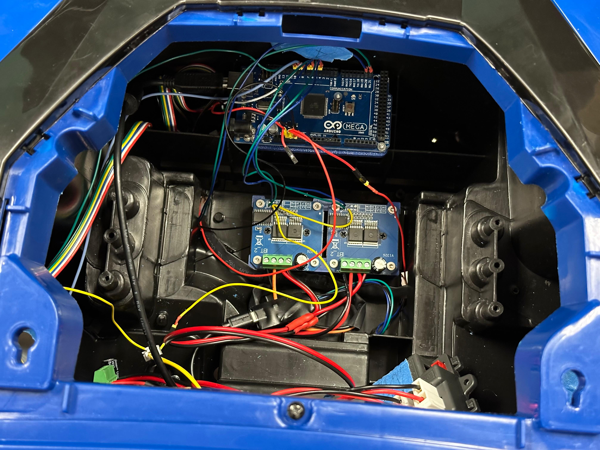
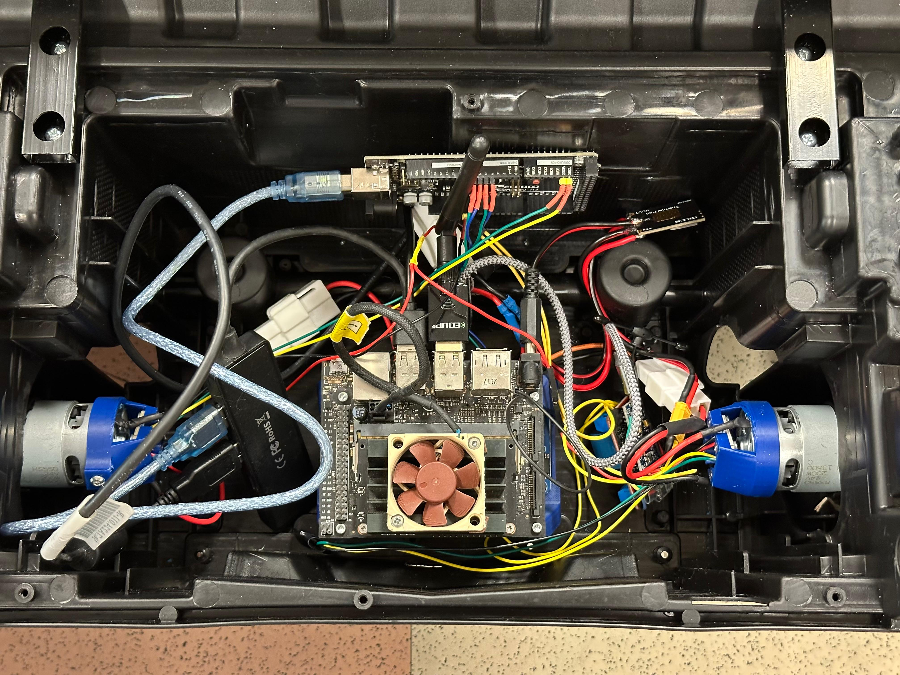
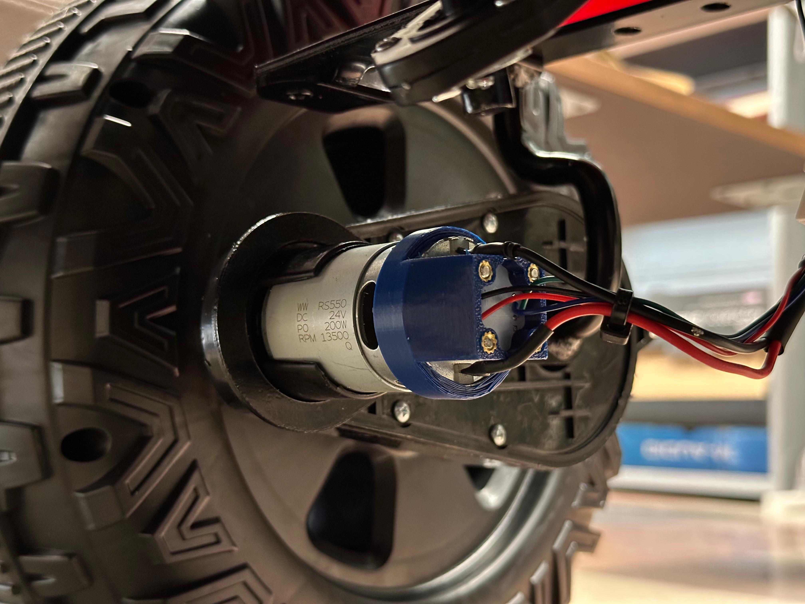
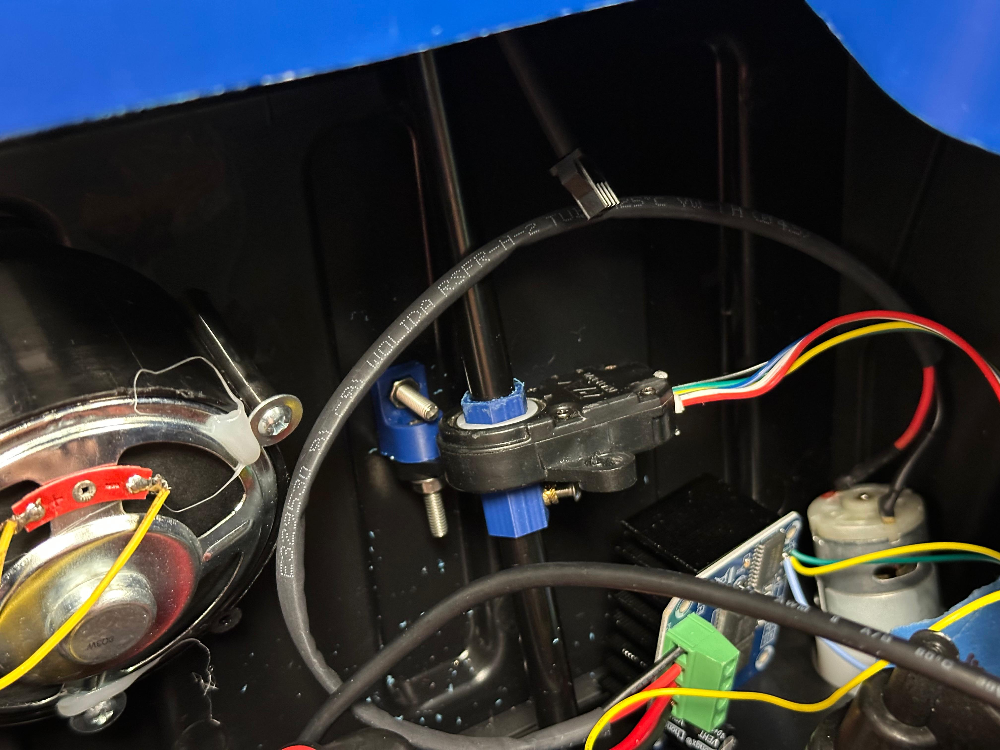

# <div align="center">Robojeep</div>

### <div align="center"> MAE 148 Final Project </div>
#### <div align="center"> Team 1 Fall 2025 </div>

<div align="center">
    
</div>

## Table of Contents
  <ol>
    <li><a href="#team-members">Team Members</a></li>
    <li><a href="#abstract">Abstract</a></li>
    <li><a href="#what-we-promised">What We Promised</a></li>
    <li><a href="#accomplishments">Accomplishments</a></li>
    <li><a href="#challenges">Challenges</a></li>
    <li><a href="#hardware">Hardware</a></li>
      <ul>
            <li><a href="#electronics">Electronics</a></li>
            <li><a href="#wiring">Wiring</a></li>
            <li><a href="#car-hardware">Car Hardware</a></li>
            <li><a href="#how-to-use">How to use</a></li>
        </ul>
   <li><a href="#software">Software</a></li>
        <ul>
            <li><a href="#quick-start">Quick start guide</a></li>
            <li><a href="#project-structure">Project structure</a></li>
        </ul>
    <li><a href="#pictures">Pictures</a></li>
    <li><a href="#final-project-videos">Final Project Videos</a></li>
    <li><a href="#ideas-for-future-teams">Ideas for future Teams</a></li>
    <li><a href="#contacts">Contacts</a></li>
  </ol>

<hr>

## Team Members
Anderson Compalas - ECE

Jobanpreet Mutti  - MAE

Saul Armenta - ECE

Bastian Müllner - UPS student visiting from TUM
<hr>

## Abstract
The projects goal is to make a kids toy car controllabe via Ros2, to provide a bigger robot car platform for future final projects. To archieve this, all of the stock car electronics besides the motors and batterys are replaced with robot componets.

<hr>

## What We Promised
### Must Have
* Fully functional low level robot control

### Nice to Have
* Artificial differential
* Skid steering
* Traction control

<hr>

## Accomplishments
* Robot is controllable via Ros2
  * Steering angle with closed loop control
  * Skid Steering
  * Forward and backward driving
* Complete Hardware installation for encoders on all 4 wheel motors
* Safe operation with seperate estop relay controlled dircly via the remote control bypassing the jetson nano
<hr>

## Challenges
* Reading the encoders fast enough to capture the motor rpm. After much optimization we got up to 9000 rpm, but not to the 13500rpm of the motor at full speed
* Passing the encoder feedback to the jetson to publish in Ros2
* Time
* Hardware issues. The gears inside the steering motor assembly were stripped, but luckily the bed lifting motor had the same gears to replace them
<hr>

## Hardware

> [!WARNING]
> Charge the battery very regularly, there is no undervoltage protection!
> It should always stay above 22.5V. If you want to check it, pull out one of the power cables in the 24V splitter in the front and use a multimeter

> [!IMPORTANT]
> The Emergency stop is the Top right button on the remote, when the green light is on it is triggered. All H-Drives need a 5V enable signal to make the motors move at all. If nothing moves, probably the estop is trigerred disabling all of the 5V enable circuit. If the red led on the relay board is on it is triggered. If parts of the car wont move, probably the enable wire is broken or unplugged somewhere. All the enable wires are yellow.

### Electronics
* Nvidia Jetson Nano: Main controller
* 2 Arduino Mega 2560:
  * Controlling all the H-Bridges
  * Reading feedback from 2 of the wheel encoders
  * Reading the steering encoder
* 2 Arduino micro pro: Reading the other two wheel encoders. Since the used encoders dont support changing their i2c adress, we can only put one per i2c bus, so one per arduino
* 5 H-Bridges: Controlling the brushed motors (https://www.amazon.com/MTDELE-H-Bridge-semiconductor-Refrigeration-Controller/dp/B0D732VYGZ/ref=sims_dp_d_dex_popular_subs_t3_v6_d_sccl_1_4/136-0486074-4523801?psc=1)
* 4 AS5600 Hall effect encoders: Reading the wheel motor rpm
* REV-11-1271 Absolute encoder: Reading the steering angle
* Radio control:
  * Radiomaster reciever: recieving commands from remote control
  * Arduino micro pro: Converting it to a usb joystick for the jetson to read with [this](https://github.com/Triton-AI/ELRSController) software
  * Relay board: When triggert it stops 5V enable signal to ALL H-Bridges, so nothing will move if this 5v signal is not switched.

 ### Wiring
<div align="left">
    
</div>

[Wiring diagram as a Smart Draw here](./Wiring/Robojeep_wiring_diagram.sdr).

<hr>

### Car Hardware
For mounting all of the electronics we 3D Printed custom brackets. All the CAD files are in [here](./CAD/).

We also improved the steering play by printing a spacer to take up the void created by the manufacturing tolerances, this greatly improved our steering accuracy
<div align="left">
    
</div>
<hr>

### How to use
#### Charging:
The car still uses the same battery and charger as before converting it to a robot. Just plug the charger that comes with it into the port on the right of the dash. For now the car automatically turns off when you plug it in, but you could rewire the charging port and power button so it doesnt.

#### Turning the car on
The power button is the switch right next to the charging port. This is also the only button on the dash that does anything. The red power button on the left does nothing.
<hr>

## Software
### Quick Start

#### 0. Pull Docker image
```bash
docker pull djnighti/ucsd_robocar:devel
```
Then add our project folder into the docker container

https://hub.docker.com/r/djnighti/ucsd_robocar

#### 1. SSH into Jetson

```bash
ssh -Y jetson@ucsdrobojeep-148-01.local
```

Password
```bash
wer#1!
```

#### 2. Start Docker Container

```bash
docker start test_container
docker exec -it test_container bash
```

#### 3. Build and Launch

Add these bash functions to your bashrc file

```bash
nano ~/.bashrc
```

```bash
function build_robojeep() {
    cd /home/projects/robojeep_ws
    source /opt/ros/foxy/setup.bash
    colcon build
    source install/setup.bash
}
# RoboJeep launch function
function launch_robojeep() {
    source /opt/ros/foxy/setup.bash
    source /home/projects/robojeep_ws/install/setup.bash
    ros2 launch robojeep_bringup robojeep.launch.py
}
```

Now from anywhere in the container (custom bash functions):

```bash
# Build the workspace
build_robojeep

# Launch the system
launch_robojeep
```

That's it! The vehicle is now ready for teleoperation.

---

### Project Structure

```
robojeep_ws/
├── src/
│   ├── robojeep_msgs/          # Custom ROS message definitions
│   ├── robojeep_base/          # Control logic and command generation
│   ├── robojeep_arduino_bridge/ # Serial communication with Arduinos
│   └── robojeep_bringup/       # Launch files and configuration
        └── config/
            └── robojeep.yaml           # Main configuration file
```

#### Package Descriptions

**robojeep_msgs**
- Defines custom message types for steering and wheel commands
- Messages: `SteeringCommand`, `WheelCommand`, `WheelFeedback`

**robojeep_base**
- `base_node_differential.py`: Converts `/cmd_vel` to vehicle-specific commands
- Implements both Ackermann and tank steering logic
- Publishes `/wheel_cmd` and `/steering_cmd`

**robojeep_arduino_bridge**
- `bridge_node_calibrated.py`: Formats ROS commands into serial protocol
- Handles serial communication with Arduino Megas
- Publishes `/serial_status` for debugging

**robojeep_bringup**
- Launch files that start all nodes together
- Configuration file (`config/robojeep.yaml`)

### Debugging with ROS2 Topics

To debug the system, you can monitor various topics to see the data flow. First, make sure to source the workspace:
```bash
source /opt/ros/foxy/setup.bash
source /home/projects/robojeep_ws/install/setup.bash
```

Then use `ros2 topic echo <topic>` to view real-time data:

**Joystick and Control Topics:**
```bash
ros2 topic echo /joy                    # Raw joystick input
ros2 topic echo /cmd_vel                # Velocity commands from teleop
ros2 topic echo /steering_cmd           # Steering angle commands
ros2 topic echo /wheel_cmd              # Wheel velocity commands
```

**Debugging Topics:**
```bash
ros2 topic echo /serial_status          # Formatted serial commands being sent
ros2 topic echo /wheel_feedback         # Encoder feedback (not implemented but structure is there)
```
## Pictures
| Front electronics without battery | Rear electronics |
|------------|-----------|
|  |  |
| Wheel encoder | Steering encoder |
|  |  |


<hr>

## Final Project Videos

[](https://www.youtube.com/watch?v=U05uUSHNJ1E)
[](https://www.youtube.com/watch?v=00laZGtpTdU)


<hr>

## Ideas for future Teams
* Add a Battery sensor: The battery shouldnt drop below 22.5V and currently there is nothing warning you or stopping the car
* Artificial differential: Compute the wheel angle and use that to compute how much faster the outer wheels in a turn need to spin
* Wire all the existing car dash and steering wheel switches to the front arduino to make them usable in your code
* In case this car should be used to transport a large payload, removing the seats will provide a large cavity for that.

<hr>

## Contacts

* Bastian Müllner - bastian.muellner@tum.de | [LinkedIn](https://www.linkedin.com/in/winston-wei-han-chou-a02214249/)
* Anderson Compalas - 
* Jobanpreet Mutti - 
* Saul Armenta -
